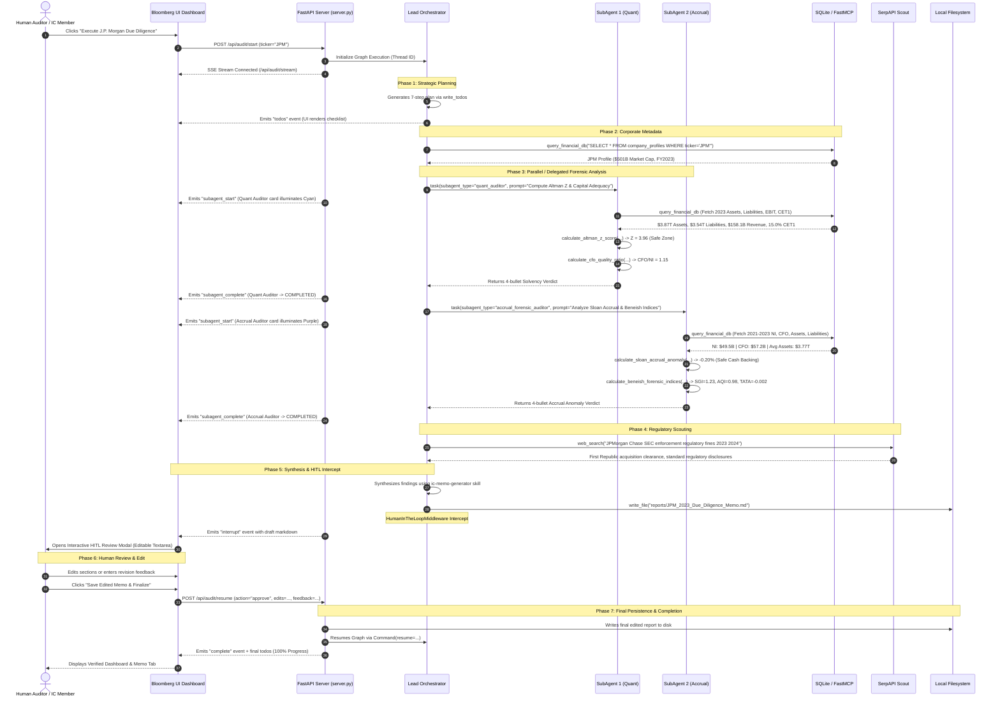

# DeepAudit-AI: Autonomous Multi-Agent Forensic Due Diligence System

> **DeepAudit-AI** is an institutional-grade autonomous financial auditing and corporate forensic system. Built on **LangGraph**, **DeepAgents**, and **Google Gemini 2.5**, it features isolated-context quantitative subagents, progressive standard operating procedure (SOP) skills, Model Context Protocol (MCP) database connectivity, and Human-in-the-Loop (HITL) investment committee safeguards.

---

## Table of Contents
1. [System Overview & Architecture](#1-system-overview--architecture)
2. [Agent Breakdown & Taxonomy](#2-agent-breakdown--taxonomy)
3. [Tools, Skills & MCP Access Matrix](#3-tools-skills--mcp-access-matrix)
4. [End-to-End Data Flow & Sequence Diagram](#4-end-to-end-data-flow--sequence-diagram)
5. [Core DeepAgent Principles](#5-core-deepagent-principles)
   - [Context Window Offloading](#a-context-window-offloading)
   - [Progressive Skills Engine](#b-progressive-skills-engine)
   - [Human-in-the-Loop (HITL) Checkpointing](#c-human-in-the-loop-hitl-checkpointing)
6. [Interactive Visualization](#6-interactive-visualization)
7. [Running the System](#7-running-the-system)

---

## 1. System Overview & Architecture

Corporate financial audits require deep qualitative synthesis across hundreds of pages of disclosures, combined with rigorous quantitative mathematics (solvency metrics, accrual anomaly tests, earnings manipulation indices). 

Monolithic LLM agents suffer from **context window dilution**, losing numerical precision and hallucinating when juggling raw 10-K tables, SEC footnotes, and algebraic computations in a single prompt history.

**DeepAudit-AI solves this through hierarchical multi-agent delegation**:
- A **Lead Orchestrator** maintains high-level planning, coordinates the overall audit roadmap, and enforces executive reporting standards.
- Specialized **Domain Subagents** are spawned with isolated context windows to execute narrow, mathematically intense tasks (Altman Z-Score, Sloan Accrual anomaly, Beneish forensic indices) and return concise executive conclusions back to the orchestrator.
- A **FastMCP Server** exposes a secure, read-only SQL layer to corporate financial databases.
- A **LangGraph Checkpointer** interrupts execution before final disk write, requiring Human Investment Committee authorization or revision feedback.

### High-Level Architectural Block Diagram

```mermaid
flowchart TB
    subgraph ClientLayer ["Client & Visualization Layer"]
        UI["DeepAudit Bloomberg Terminal UI<br/>(Tailwind + Vanilla JS + SSE)"]
        HTML_VIZ["Interactive Architecture Visualizer<br/>(architecture.html)"]
    end

    subgraph ServerLayer ["Server & Streaming Engine"]
        FASTAPI["FastAPI / Uvicorn Server<br/>(server.py)"]
        SSE["Server-Sent Events (SSE) Bus<br/>(agent_events, agentStates)"]
    end

    subgraph DeepAgentGraph ["LangGraph Multi-Agent Harness (agent.py)"]
        ORCH["👑 Lead Forensic Auditor<br/>(DeepAudit-AI Orchestrator)"]
        
        subgraph SubAgents ["Specialized Sub-Agents (Isolated Context)"]
            QUANT["📊 SubAgent 1: Quant Solvency Auditor<br/>(quant_auditor)"]
            ACCRUAL["🔍 SubAgent 2: Accruals & Forensics Auditor<br/>(accrual_forensic_auditor)"]
        end

        subgraph SkillsEngine ["Progressive Skills Engine (/skills)"]
            SKILL_SEC["sec-10k-audit/SKILL.md"]
            SKILL_FOR["forensic-accounting/SKILL.md"]
            SKILL_MEMO["ic-memo-generator/SKILL.md"]
        end

        subgraph Toolset ["Tool Infrastructure"]
            MATH_TOOLS["Deterministic Math Tools<br/>• Altman Z-Score<br/>• Sloan Accrual Ratio<br/>• Beneish Forensic Indices<br/>• CFO Quality Ratio"]
            WEB_TOOL["Regulatory Scout<br/>• SerpAPI Web Search"]
            DB_TOOL["Database Tool<br/>• query_financial_db"]
        end

        CHECKPOINT["LangGraph Checkpointer<br/>(MemorySaver)"]
    end

    subgraph DataMCP ["Data & Protocol Layer"]
        MCP_SRV["FastMCP Server<br/>(mcp_server.py)"]
        SQLITE[("financial_audit.db<br/>• company_profiles<br/>• financial_statements<br/>• audit_flags")]
    end

    subgraph Deliverables ["Audit Deliverables"]
        MEMO[("reports/JPM_2023_Due_Diligence_Memo.md")]
    end

    %% Connections
    UI <-->|HTTP / SSE Stream| FASTAPI
    FASTAPI <-->|Thread Streaming & Resume| DeepAgentGraph
    
    ORCH -->|Delegates via task()| QUANT
    ORCH -->|Delegates via task()| ACCRUAL
    QUANT -.->|Concise 4-bullet summary| ORCH
    ACCRUAL -.->|Concise 4-bullet summary| ORCH

    ORCH -.->|Loads SOPs dynamically| SkillsEngine
    QUANT -.->|References benchmarks| SKILL_FOR
    ACCRUAL -.->|References benchmarks| SKILL_FOR

    QUANT -->|Executes| MATH_TOOLS
    QUANT -->|Queries| DB_TOOL
    ACCRUAL -->|Executes| MATH_TOOLS
    ACCRUAL -->|Queries| DB_TOOL

    ORCH -->|Queries| DB_TOOL
    ORCH -->|Scouts| WEB_TOOL

    DB_TOOL <-->|Read-Only SQL| SQLITE
    MCP_SRV <-->|FastMCP Protocol| SQLITE

    ORCH -->|write_file| CHECKPOINT
    CHECKPOINT -->|Interrupt for HITL Approval| UI
    UI -->|Command(resume=...)| CHECKPOINT
    CHECKPOINT -->|Persists Verified Memo| MEMO
```

---

## 2. Agent Breakdown & Taxonomy

| Agent | Architecture Role | Responsibilities | Context Boundary |
| :--- | :--- | :--- | :--- |
| **👑 Lead Forensic Auditor** (`DeepAudit-AI`) | Primary Orchestrator | • Formulates audit checklist (`write_todos`)<br/>• Orchestrates task delegation via `task()`<br/>• Gathers corporate profiles & macro disclosures<br/>• Conducts SEC litigation / regulatory scouting<br/>• Synthesizes subagent findings into boardroom IC Memorandum<br/>• Submits draft for Human-in-the-Loop signoff | Global graph state. Maintains high-level audit roadmap. Offloads deep numerical operations to subagents to prevent token bloat. |
| **📊 Quant Solvency Auditor** (`quant_auditor`) | Domain Subagent | • Queries 3-year balance sheets and capital ratios<br/>• Evaluates short-term liquidity & asset productivity<br/>• Computes **Altman Z-Score** solvency classification<br/>• Validates **Basel III CET1 Capital Adequacy** ($\ge 12\%$) | Ephemeral, isolated context. Receives specific prompt from orchestrator; executes queries and math; returns a 3-4 bullet synthesis. Memory is discarded post-task. |
| **🔍 Accruals & Earnings Forensic Auditor** (`accrual_forensic_auditor`) | Domain Subagent | • Analyzes multi-year cash flow vs. net earnings divergence<br/>• Calculates **Sloan Accrual Anomaly** ($[NI - CFO] / AvgAssets$)<br/>• Computes **Beneish Forensic Manipulation Indices** (SGI, AQI, TATA)<br/>• Flags aggressive revenue or deferred cost capitalization | Ephemeral, isolated context. Executes database queries and forensic formulas; returns a structured 3-4 bullet anomaly assessment. |

---

## 3. Tools, Skills & MCP Access Matrix

DeepAudit-AI enforces the **Principle of Least Privilege**: agents receive only the tools and skills strictly required for their analytical domain.

```
┌──────────────────────────────────────────────────────────────────────────────────────────┐
│                               AGENT CAPABILITY MATRIX                                   │
├──────────────────────────┬───────────────────┬───────────────────┬───────────────────────┤
│ Capability               │ Lead Orchestrator │ Quant Auditor     │ Accruals Auditor      │
├──────────────────────────┼───────────────────┼───────────────────┼───────────────────────┤
│ Model                    │ Gemini 2.5 Pro    │ Gemini 2.5 Flash  │ Gemini 2.5 Flash      │
│ Context Lifetime         │ Persistent Thread │ Ephemeral Task    │ Ephemeral Task        │
├──────────────────────────┼───────────────────┼───────────────────┼───────────────────────┤
│ Tools:                   │                   │                   │                       │
│ • query_financial_db     │ ✅ Available       │ ✅ Available       │ ✅ Available           │
│ • calculate_altman_z     │ ❌ Delegated      │ ✅ Dedicated       │ ❌ No Access          │
│ • calculate_cfo_quality  │ ❌ Delegated      │ ✅ Dedicated       │ ❌ No Access          │
│ • calculate_sloan_accrual│ ❌ Delegated      │ ❌ No Access      │ ✅ Dedicated           │
│ • calculate_beneish      │ ❌ Delegated      │ ❌ No Access      │ ✅ Dedicated           │
│ • web_search (SerpAPI)   │ ✅ Dedicated       │ ❌ No Access      │ ❌ No Access          │
│ • task() (Subagent Spawn)│ ✅ Orchestration   │ ❌ Subordinate    │ ❌ Subordinate        │
│ • write_todos            │ ✅ Planning        │ ❌ Subordinate    │ ❌ Subordinate        │
│ • write_file (Report)    │ ✅ Triggers HITL  │ ❌ Read-Only      │ ❌ Read-Only          │
├──────────────────────────┼───────────────────┼───────────────────┼───────────────────────┤
│ Progressive Skills:      │                   │                   │                       │
│ • sec-10k-audit          │ ✅ Active Guide   │ ❌ Not Loaded     │ ❌ Not Loaded         │
│ • forensic-accounting    │ 📖 Reference      │ ✅ Active Rules   │ ✅ Active Rules       │
│ • ic-memo-generator      │ ✅ Active Guide   │ ❌ Not Loaded     │ ❌ Not Loaded         │
├──────────────────────────┼───────────────────┼───────────────────┼───────────────────────┤
│ FastMCP Server:          │                   │                   │                       │
│ • financial_database     │ 🔌 FastMCP Tool   │ 🔌 Direct Driver  │ 🔌 Direct Driver      │
└──────────────────────────┴───────────────────┴───────────────────┴───────────────────────┘
```

### Progressive Skills Overview
- **`sec-10k-audit/SKILL.md`**: Provides Standard Operating Procedures for navigating SEC Form 10-K Item 7 (MD&A) and Item 8 (Financial Statements, Notes, Credit Reserves).
- **`forensic-accounting/SKILL.md`**: Implements quantitative formulas, variable weights, and interpretation thresholds:
  - **Altman Z-Score**:
    $$Z = 1.2 X_1 + 1.4 X_2 + 3.3 X_3 + 0.6 X_4 + 0.999 X_5$$
    *(Safe $> 2.99$, Grey $1.81 - 2.99$, Distress $< 1.81$)*
  - **Sloan Accrual Ratio**:
    $$\text{Ratio} = \frac{\text{Net Income} - \text{Operating Cash Flow}}{\text{Average Total Assets}} \times 100\%$$
    *(High Cash Quality $< -3\%$, Normal $-3\%$ to $+8\%$, High Distortion $> +10\%$)*
  - **Beneish Forensic Indices**: Sales Growth Index (SGI), Asset Quality Index (AQI), Total Accruals to Total Assets (TATA).
  - **CET1 Capital Adequacy**: Benchmark $\ge 12.0\%$ (JPM FY2023 = $15.0\%$).
- **`ic-memo-generator/SKILL.md`**: Dictates the executive structure, section hierarchy, markdown formatting, and sign-off block required for the Investment Committee Due Diligence Memorandum.

### FastMCP Server (`mcp_server.py`)
Built on Anthropic's **FastMCP** framework (`FastMCP("financial_database")`), providing standardized protocol tools over stdio/SSE:
- `query_financial_db(sql_query)`: Guarded SQL executor permitting only read-only queries (`SELECT`, `WITH`).
- `get_company_profile(ticker)`: Extracts corporate profile, reporting currency, sector, and latest fiscal year.
- `get_historical_financials(ticker)`: Returns 3-year balance sheets, income statements, and cash flow records.

---

## 4. End-to-End Data Flow & Sequence Diagram

The following sequence diagram traces the complete lifecycle of an audit run, from initial trigger to human sign-off:



---

## 5. Core DeepAgent Principles

### A. Context Window Offloading
In monolithic agent setups, extracting balance sheets across 3 fiscal years consumes thousands of tokens. Adding intermediate arithmetic, debug steps, and SQL error loops quickly degrades the LLM's attention span.

**DeepAudit-AI delegates via `task()`**:
- The Lead Orchestrator never sees raw SQL rows or intermediate equation variables.
- SubAgents spin up in private contexts, execute their queries, compute math deterministically via Python functions, and return a clean **markdown synthesis**.
- The Orchestrator’s prompt remains compact ($\approx 2,000\text{ tokens}$), preserving focus for high-level diligence synthesis.

### B. Progressive Skills Engine
Skills are loaded dynamically from `/skills/<skill-name>/SKILL.md`. Rather than stuffing every conceivable accounting formula into the system prompt:
- Skills define **when to use** and standard operating procedures.
- DeepAgents progressively loads skill rules when matching keywords or file tasks arise.
- Mathematical functions (`ratios.py`, `beneish_sloan.py`) are strictly decoupled from prompt generation and executed via dedicated `@tool` calls.

### C. Human-in-the-Loop (HITL) Checkpointing
Using LangGraph's `MemorySaver` checkpointer and `interrupt_on={"write_file": True}`:
- The agent is halted the moment it attempts to publish the final due diligence report.
- The execution thread freezes in state; the UI extracts the proposed file contents and presents them in an **institutional markdown editor**.
- The human investment committee can:
  1. **Directly edit** text, conclusions, or risk ratings and save.
  2. **Provide natural language revision feedback** (`"Add a section detailing FDIC special assessment fees"`) to re-trigger subagent investigation.
  3. **Authorize as-is** to immediately sign off.

---

## 6. Interactive Visualization

An interactive architecture visualizer is provided in [`architecture.html`](./architecture.html).

### Features:
- **Clickable Component Inspector**: Inspect system prompts, tool permissions, mathematical formulas, and isolation barriers for every agent.
- **Interactive Step-by-Step Data Flow Simulator**: Step through all 7 phases with animated data packets and visual signal highlights.
- **Formulas & Mathematical Proofs**: Explore Altman Z, Sloan Accrual, and Beneish M-Score equations with threshold color coding.
- **HITL State Machine Diagram**: View the exact LangGraph pause-and-resume lifecycle.

To launch the visualizer:
```bash
# macOS
open Deep_Agents/deepaudit/architecture.html

# Linux
xdg-open Deep_Agents/deepaudit/architecture.html
```

Or access it directly from the live dashboard navigation bar.

---

## 7. Running the System (Two-Terminal Architecture)

To run the complete system with the FastMCP Database Server decoupled from the audit dashboard, open two terminals:

### Step 1: Start the FastMCP Database Server (Terminal 1)
```bash
# Terminal 1: Starts FastMCP on port 8001 over SSE
python Deep_Agents/deepaudit/mcp_server.py
```
Output:
```text
============================================================
🚀 DeepAudit-AI FastMCP Database Server Active
🌐 Transport: SSE (Server-Sent Events)
📡 Endpoint:  http://127.0.0.1:8001/sse
📦 Tools Exposed:
   • query_financial_db        (Read-Only SQL Executor)
   • get_company_profile       (Corporate Metadata)
   • get_historical_financials (3-Year Statements)
============================================================
```

### Step 2: Start the DeepAudit-AI Streaming Dashboard (Terminal 2)
```bash
# Terminal 2: Starts the Bloomberg UI and connects to the MCP Server
python Deep_Agents/deepaudit/run_dashboard.py
```
Open **[http://localhost:8000](http://localhost:8000)** in your browser.

> [!NOTE]
> The agents connect to the FastMCP Database Server using `langchain_mcp_adapters.client.MultiServerMCPClient`. If the FastMCP server in Terminal 1 is not running, the system automatically falls back to spawning it via `stdio` transport, ensuring the agents always communicate strictly through the MCP protocol.

---

*Authored for institutional forensic due diligence and autonomous multi-agent financial research.*

