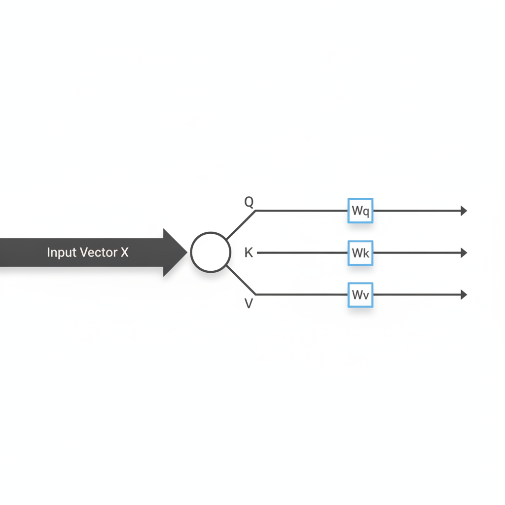
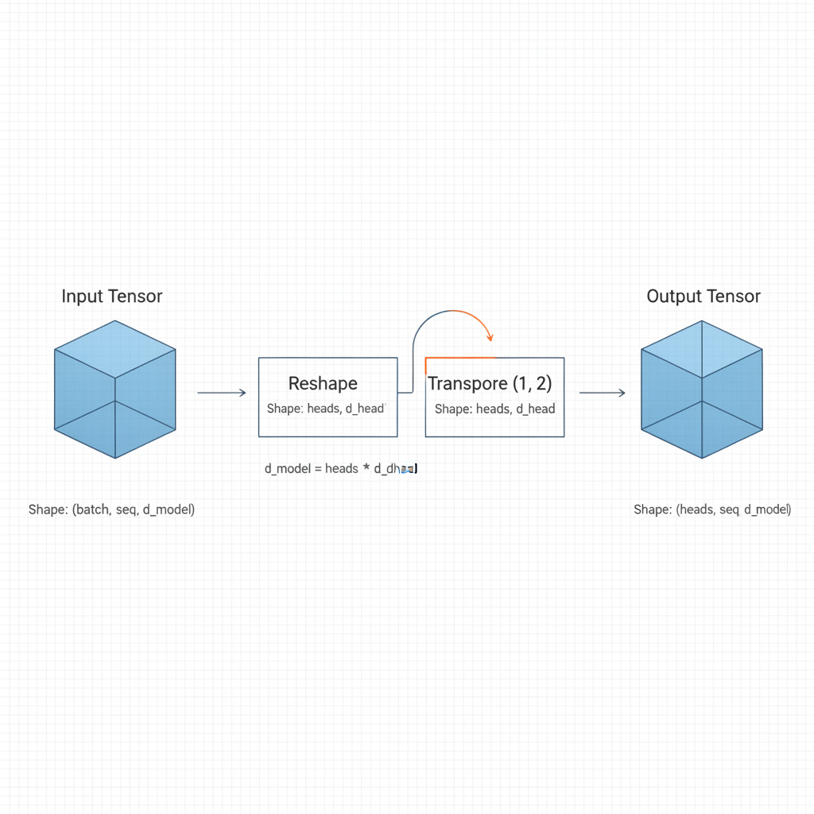
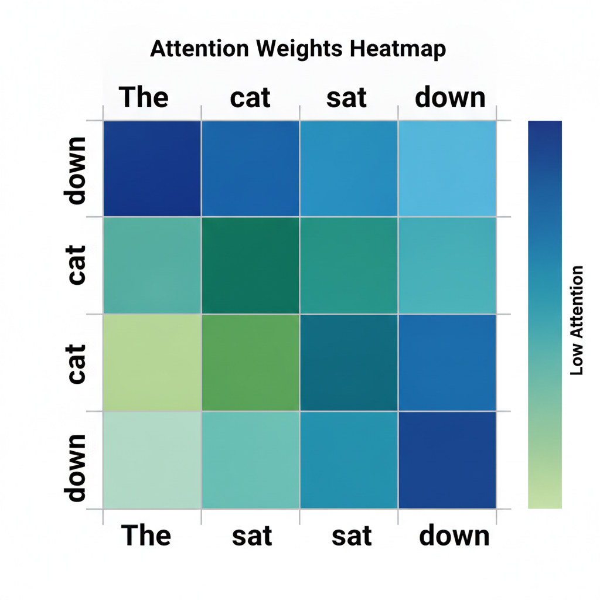

# Visualizing the Transformer Attention Mechanism: A Python Implementation

## Deconstructing the Attention Mechanism

At the heart of the Transformer architecture lies the self-attention mechanism, which allows models to weigh the importance of different tokens in a sequence. This process relies on three distinct projections derived from the input embeddings:

* **Query (Q):** Represents the current token seeking information.
* **Key (K):** Acts as a label for all tokens in the sequence, describing what information they contain.
* **Value (V):** Contains the actual content or features that will be propagated forward if a match is found.


*The QKV projection process: Input embeddings are transformed into Query, Key, and Value vectors via learned weight matrices.*

To generate these, we project the input embedding matrix $X$ into three separate spaces using learned weight matrices $W_Q$, $W_K$, and $W_V$. Mathematically, $Q = XW_Q$, $K = XW_K$, and $V = XW_V$. This transformation allows the model to learn task-specific representations for each token.

The interaction between these vectors is governed by the scaled dot-product attention formula:

$$
\text{Attention}(Q, K, V) = \text{softmax}\left(\frac{QK^T}{\sqrt{d_k}}\right)V
$$

## Setting Up the Projection Layers

To implement the attention mechanism, we first transform the input embeddings into Query (Q), Key (K), and Value (V) vectors. This is achieved by projecting the input tensor $X$ of shape `(batch_size, seq_len, d_model)` through three distinct linear layers.


*Tensor reshaping flow: The projection output is split into multiple heads to allow parallel attention processing.*

### Initializing Projections

In PyTorch, we define these as `nn.Linear` layers. Each layer maps the hidden dimension `d_model` to the total dimension of all heads combined, typically `d_model` itself.

```python
import torch
import torch.nn as nn

d_model = 512
n_heads = 8
d_head = d_model // n_heads

# Initialize Q, K, V projections
q_proj = nn.Linear(d_model, d_model)
k_proj = nn.Linear(d_model, d_model)
v_proj = nn.Linear(d_model, d_model)
```

## Visualizing the Flow with Matplotlib

To debug how a Transformer model allocates its "attention" across an input sequence, we must visualize the attention matrix. This matrix, typically the result of the softmax operation applied to the scaled dot-product of Queries and Keys, represents the probability distribution of how much focus each token places on every other token in the sequence.


*An attention heatmap visualizing the probability distribution of tokens attending to one another.*

### Generating the Heatmap

Using `matplotlib` or `seaborn`, we can transform the raw attention weights into a heatmap. This provides an immediate visual cue regarding the model's internal dependencies.
