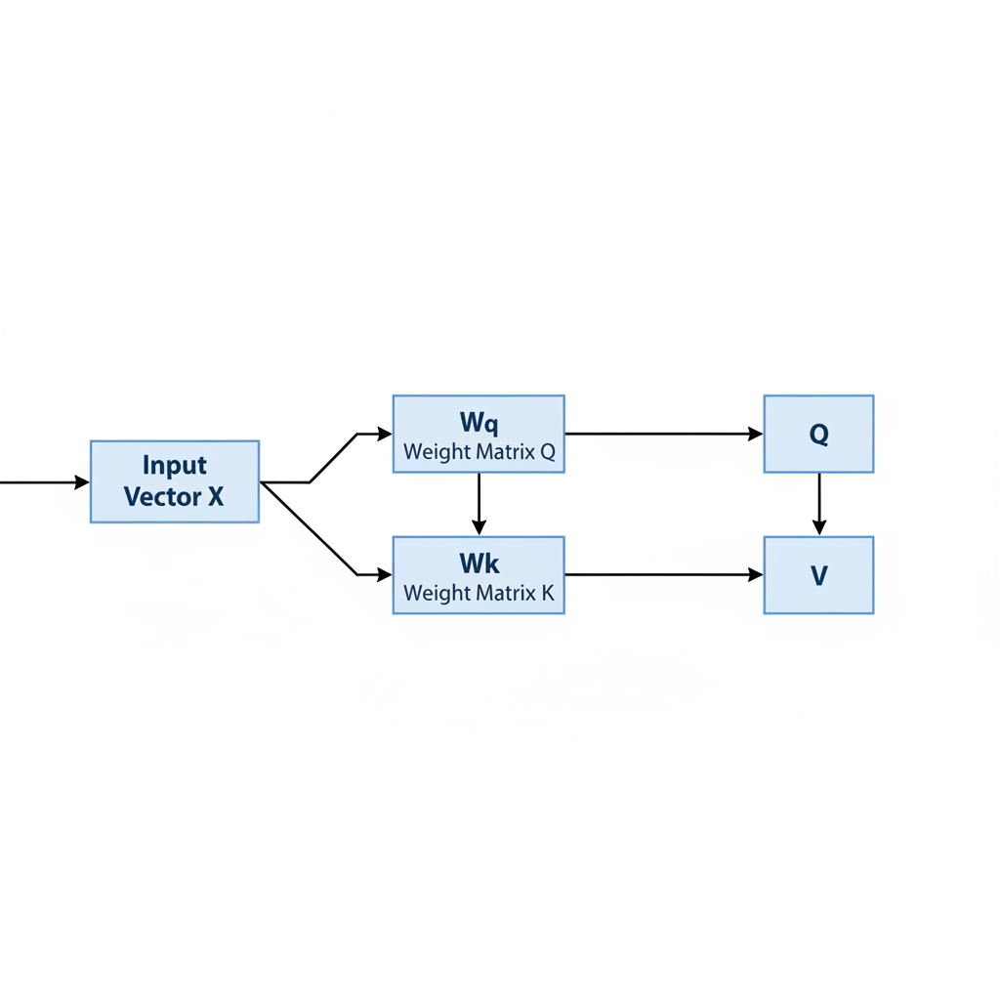
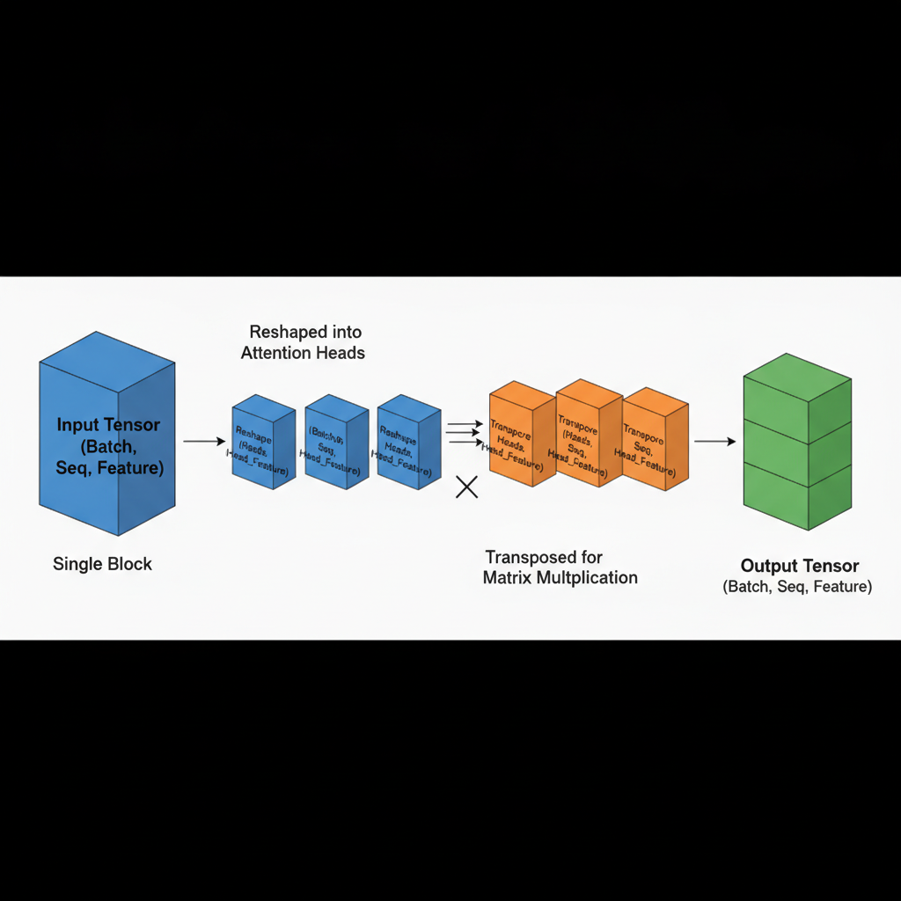
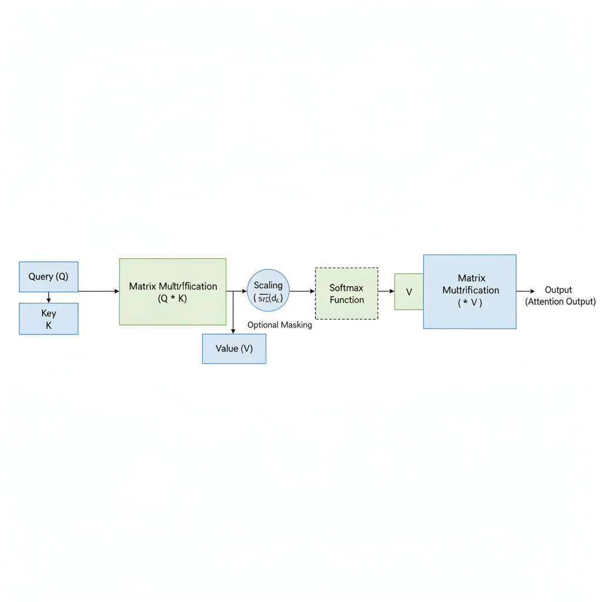
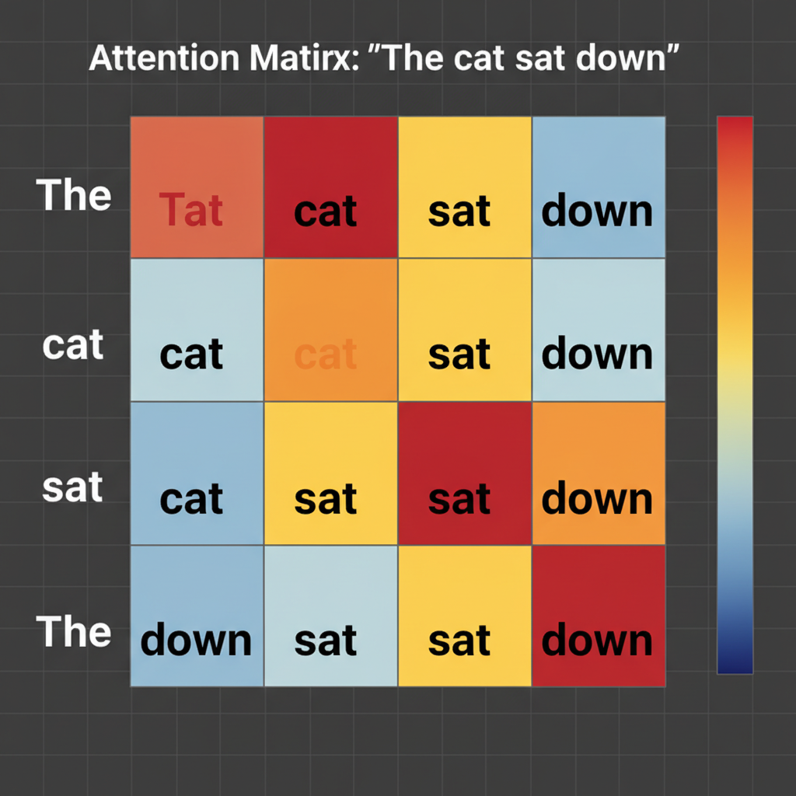

# Visualizing the Transformer Attention Mechanism: A Python Implementation

## Deconstructing the Attention Mechanism

At the heart of the Transformer architecture lies the self-attention mechanism, which allows models to weigh the importance of different tokens in a sequence. This process relies on three distinct projections derived from the input embeddings:

* **Query (Q):** Represents the current token seeking information.
* **Key (K):** Acts as a label for all tokens in the sequence, describing what information they contain.
* **Value (V):** Contains the actual content or features that will be propagated forward if a match is found.


*The input embedding matrix X is projected into Query, Key, and Value matrices using learned weight matrices.*

To generate these, we project the input embedding matrix $X$ into three separate spaces using learned weight matrices $W_Q$, $W_K$, and $W_V$. Mathematically, $Q = XW_Q$, $K = XW_K$, and $V = XW_V$. This transformation allows the model to learn task-specific representations for each token.

The interaction between these vectors is governed by the scaled dot-product attention formula:

$$
\text{Attention}(Q, K, V) = \text{softmax}\left(\frac{QK^T}{\sqrt{d_k}}\right)V
$$

The dot product $QK^T$ computes a raw similarity score between every pair of tokens. We divide this result by $\sqrt{d_k}$—the square root of the dimension of the keys—to serve as a critical scaling factor. Without this normalization, the dot products can grow excessively large in magnitude, pushing the softmax function into regions where gradients are extremely small. This "vanishing gradient" effect would effectively stall the learning process during backpropagation.

By applying the softmax function to these scaled scores, we convert them into a probability distribution. Multiplying this distribution by the Value matrix $V$ produces a weighted sum, effectively allowing the model to focus on the most relevant tokens while ignoring irrelevant noise.

## Setting Up the Projection Layers

To implement the attention mechanism, we first transform the input embeddings into Query (Q), Key (K), and Value (V) vectors. This is achieved by projecting the input tensor $X$ of shape `(batch_size, seq_len, d_model)` through three distinct linear layers.

### Initializing Projections

In PyTorch, we define these as `nn.Linear` layers. Each layer maps the hidden dimension `d_model` to the total dimension of all heads combined, typically `d_model` itself.

```python
import torch
import torch.nn as nn

d_model = 512
n_heads = 8
d_head = d_model // n_heads

# Initialize Q, K, V projections
q_proj = nn.Linear(d_model, d_model)
k_proj = nn.Linear(d_model, d_model)
v_proj = nn.Linear(d_model, d_model)
```

### Reshaping for Multi-Head Attention

After projection, we must reshape the tensors to isolate individual heads. We split the `d_model` dimension into `(n_heads, d_head)`. This allows the model to attend to different parts of the sequence simultaneously.


*Reshaping the projected tensor to isolate individual attention heads.*

```python
def reshape_for_heads(x, batch_size, seq_len):
    # Reshape to (batch, seq_len, n_heads, d_head)
    x = x.view(batch_size, seq_len, n_heads, d_head)
    # Transpose to (batch, n_heads, seq_len, d_head) for matrix multiplication
    return x.transpose(1, 2)
```

### Verifying Dimensions

Verification is critical to ensure the flow remains consistent. If your input is `(32, 10, 512)`, the projection output remains `(32, 10, 512)`. After reshaping, the tensor becomes `(32, 8, 10, 64)`. This confirms that each head processes a 64-dimensional subspace, maintaining the integrity of the original hidden size.

### Importance of Weight Initialization

Weight initialization is vital for stable training. If weights are initialized too large, the dot product in the attention mechanism can produce extreme values, pushing the Softmax function into regions with vanishing gradients. Conversely, weights that are too small lead to signal decay. Using techniques like Xavier or Kaiming initialization ensures that the variance of activations remains consistent across layers, preventing the "exploding" or "vanishing" gradient problems that frequently plague deep Transformer architectures during the initial phases of convergence.

## Calculating the Attention Scores

The core of the Transformer architecture lies in the scaled dot-product attention mechanism. To compute the attention scores, we first perform a matrix multiplication between the Query ($Q$) and the transpose of the Key ($K$) matrices. This operation measures the compatibility between each query and every key in the sequence, resulting in a raw score matrix of shape $(seq\_len, seq\_len)$.


*The scaled dot-product attention process: Q*K^T, scaling, masking, softmax, and final multiplication with V.*

```python
import torch
import torch.nn.functional as F

def compute_attention(q, k, v, mask=None):
    # 1. Matrix multiplication of Q and K transpose
    d_k = q.size(-1)
    scores = torch.matmul(q, k.transpose(-2, -1))
  
    # 2. Apply scaling factor
    scores = scores / (d_k ** 0.5)
  
    # 3. Apply masking (optional)
    if mask is not None:
        scores = scores.masked_fill(mask == 0, float('-inf'))
      
    # 4. Softmax normalization
    attn_weights = F.softmax(scores, dim=-1)
    return torch.matmul(attn_weights, v)
```

The scaling factor, defined as $1/\sqrt{d_k}$, is critical for numerical stability. Without it, the dot products can grow large in magnitude, pushing the softmax function into regions where gradients are extremely small, effectively stalling the training process. By scaling, we ensure the variance of the dot products remains close to one.

After scaling, we apply the softmax function across the last dimension. This converts the raw scores into a probability distribution, where each row sums to one. These weights represent the "attention" the model pays to different tokens in the input sequence when generating the current output.

In decoder-only models, such as GPT, we must prevent the model from attending to future tokens. We implement this using a causal mask—a lower triangular matrix filled with zeros and negative infinities. By applying this mask before the softmax, we force the attention weights for future tokens to zero. This prevents "look-ahead bias," ensuring that the prediction for a specific position depends only on known, preceding tokens. This mathematical constraint is what allows the model to maintain its autoregressive property during training, effectively hiding the "future" from the attention mechanism while processing the sequence in parallel.

## Visualizing the Flow with Matplotlib

To debug how a Transformer model allocates its "attention" across an input sequence, we must visualize the attention matrix. This matrix, typically the result of the softmax operation applied to the scaled dot-product of Queries and Keys, represents the probability distribution of how much focus each token places on every other token in the sequence.

### Generating the Heatmap

Using `matplotlib` or `seaborn`, we can transform the raw attention weights into a heatmap. This provides an immediate visual cue regarding the model's internal dependencies.


*A heatmap visualization of an attention matrix, where axes represent input tokens.*

```python
import matplotlib.pyplot as plt
import seaborn as sns
import numpy as np

def plot_attention(attention_matrix, tokens):
    plt.figure(figsize=(10, 8))
    sns.heatmap(attention_matrix, xticklabels=tokens, yticklabels=tokens, 
                cmap='viridis', square=True)
    plt.xlabel('Key Tokens')
    plt.ylabel('Query Tokens')
    plt.title('Attention Mechanism Heatmap')
    plt.show()

# Example usage with a 4x4 attention matrix
attn = np.random.rand(4, 4)
tokens = ["The", "cat", "sat", "down"]
plot_attention(attn, tokens)
```

### Mapping Tokens to Axes

For the visualization to be actionable, the axes must be labeled with the actual input tokens. By mapping token indices to the `xticklabels` and `yticklabels` parameters, you can trace specific linguistic relationships. If the model is performing well, you will often see high-intensity clusters along the diagonal (local context) or specific off-diagonal spikes representing long-range dependencies, such as a pronoun attending to its antecedent.

### Interpreting High-Intensity Clusters

High-intensity clusters indicate that the model has assigned a high probability mass to specific token pairs. A bright spot at `(i, j)` signifies that the token at index `i` is heavily utilizing information from the token at index `j` to construct its representation. If you observe a "blur" of high intensity, the model may be struggling to focus, whereas sharp, isolated points suggest precise feature extraction.

### Handling Long Sequences

As sequence length increases, the heatmap becomes cluttered, making individual token relationships impossible to discern. To mitigate this:

1. **Sub-sampling:** Visualize only a sliding window of the sequence (e.g., a 50x50 sub-matrix).
2. **Aggregation:** Average the attention heads across layers to identify general patterns rather than head-specific noise.
3. **Clustering:** Use hierarchical clustering to reorder the matrix, grouping tokens that exhibit similar attention patterns. This reveals structural dependencies that are otherwise hidden in the raw, sequential layout.

## Performance and Observability Considerations

The self-attention mechanism is the primary engine of the Transformer architecture, but it introduces significant computational overhead. The core bottleneck is the attention matrix, which is computed by taking the dot product of the Query ($Q$) and Key ($K$) matrices. For a sequence of length $n$, this results in an $n \times n$ matrix. Consequently, the memory complexity scales quadratically, $O(n^2)$, with the sequence length. As $n$ grows, the memory footprint for storing these intermediate attention scores quickly exceeds the capacity of standard GPU VRAM, limiting the context window size for long-form generation.

To mitigate these constraints, modern implementations leverage FlashAttention. Unlike standard attention, which materializes the full $n \times n$ matrix in high-bandwidth memory (HBM), FlashAttention uses tiling to break the computation into smaller blocks. By keeping these blocks in the faster SRAM, it minimizes expensive read/write operations between the GPU and main memory. This approach not only reduces memory usage but also significantly accelerates training and inference throughput by optimizing the memory access patterns.

For practitioners, observability is critical when debugging model behavior. During inference, logging attention weights provides a window into the model's "focus." By capturing the output of the softmax layer, you can visualize which tokens the model prioritizes when generating a response. Tools like `torch.hooks` allow you to intercept these tensors without modifying the core model architecture. When logging, ensure you normalize these weights across heads to identify patterns, such as whether the model is attending to syntactic markers or semantic entities.

Finally, numerical instability remains a common failure mode in attention implementations. The softmax function is particularly sensitive to large input values, which can lead to vanishing gradients or overflow errors. To maintain stability, always apply a scaling factor—typically $1/\sqrt{d_k}$, where $d_k$ is the dimension of the keys—before the softmax operation. Additionally, ensure that your implementation handles masking correctly; applying a large negative value (e.g., $-1e9$) to masked positions before softmax prevents the model from attending to padding tokens or future information in causal decoders, ensuring the probability distribution remains valid and the model remains robust during long-sequence generation.
