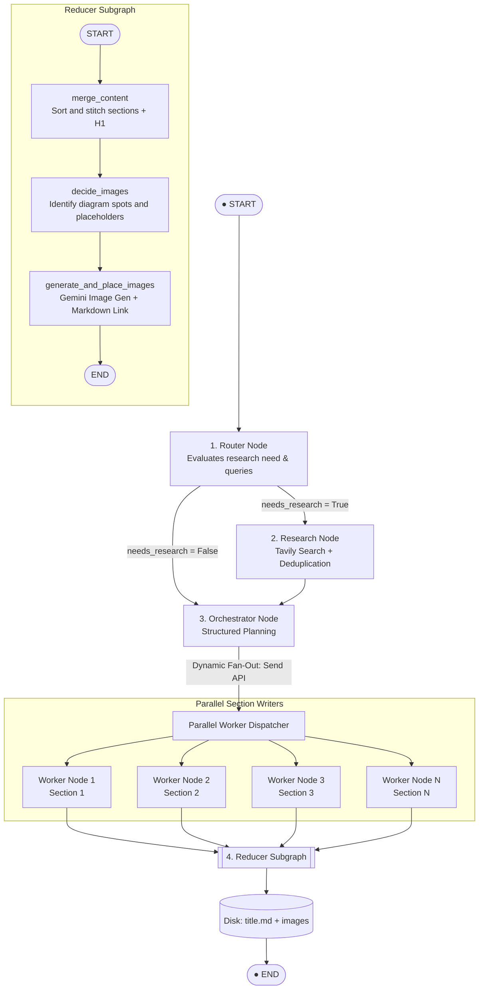

# Blog Research & Writing Agent with Image Capability

> **Comprehensive Architectural Guide & Code Walkthrough** for [`blog_research_writing_agent_with_image.ipynb`](blog_research_writing_agent_with_image.ipynb)

---

## 1. System Overview & Architecture

This notebook implements an autonomous, end-to-end technical blog generation pipeline built with **LangGraph** and **Google Gemini (`gemini-3.1-flash-lite` and `gemini-2.5-flash-image`)**.

It intelligently assesses topic volatility, gathers live research via **Tavily**, plans a structured outline, fans out section drafting to concurrent workers in parallel, and finishes in a specialized **Reducer Subgraph** that designs technical diagrams, generates them with Gemini Flash Image, and compiles the final Markdown article.

### High-Level Architecture Flowchart



---

## 2. Pydantic Schema Cards

The pipeline relies on **strict Pydantic schemas** to enforce type safety, predictable structured outputs from Gemini, and robust graph transitions. Below are the schema cards and where each is utilized across the pipeline.

### Schema Cards Overview

```
┌────────────────────────────────────────────────────────────────────────────────────────┐
│ 🗂️ SCHEMA CARD 1: RouterDecision                                                       │
├────────────────────────────────────────────────────────────────────────────────────────┤
│ Attributes:                                                                            │
│   • needs_research : bool                                                              │
│   • mode           : Literal["closed_book", "hybrid", "open_book"]                     │
│   • queries        : List[str]                                                         │
├────────────────────────────────────────────────────────────────────────────────────────┤
│ 🎯 Purpose: Determines topic volatility and formulates upfront targeted search queries.│
│ 📍 Utilized in: Block 4 (Router Node)                                                  │
└────────────────────────────────────────────────────────────────────────────────────────┘

┌────────────────────────────────────────────────────────────────────────────────────────┐
│ 🗂️ SCHEMA CARD 2: EvidenceItem                                                         │
├────────────────────────────────────────────────────────────────────────────────────────┤
│ Attributes:                                                                            │
│   • title        : str                                                                 │
│   • url          : str                                                                 │
│   • published_at : Optional[str]                                                       │
│   • snippet      : Optional[str]                                                       │
│   • source       : Optional[str]                                                       │
├────────────────────────────────────────────────────────────────────────────────────────┤
│ 🎯 Purpose: Represents an individual, authoritative web reference with metadata.       │
│ 📍 Utilized in: Block 5 (Research Node), Block 6 (Orchestrator), Block 7 (Worker)       │
└────────────────────────────────────────────────────────────────────────────────────────┘

┌────────────────────────────────────────────────────────────────────────────────────────┐
│ 🗂️ SCHEMA CARD 3: EvidencePack                                                         │
├────────────────────────────────────────────────────────────────────────────────────────┤
│ Attributes:                                                                            │
│   • evidence : List[EvidenceItem]                                                      │
├────────────────────────────────────────────────────────────────────────────────────────┤
│ 🎯 Purpose: Container for structured LLM extraction and deduplication of raw searches.│
│ 📍 Utilized in: Block 5 (Research Node)                                                │
└────────────────────────────────────────────────────────────────────────────────────────┘

┌────────────────────────────────────────────────────────────────────────────────────────┐
│ 🗂️ SCHEMA CARD 4: Task                                                                 │
├────────────────────────────────────────────────────────────────────────────────────────┤
│ Attributes:                                                                            │
│   • id                  : int                                                          │
│   • title               : str                                                          │
│   • goal                : str (1 sentence target)                                      │
│   • bullets             : List[str] (3 to 6 concrete, non-overlapping points)          │
│   • target_words        : int (120 - 550 words)                                        │
│   • tags                : List[str]                                                    │
│   • requires_research   : bool = False                                                 │
│   • requires_citations  : bool = False                                                 │
│   • requires_code       : bool = False                                                 │
├────────────────────────────────────────────────────────────────────────────────────────┤
│ 🎯 Purpose: Complete blueprint and constraints for an individual blog section.         │
│ 📍 Utilized in: Block 6 (Orchestrator Node), Block 7 (Fan-out & Worker Node)           │
└────────────────────────────────────────────────────────────────────────────────────────┘

┌────────────────────────────────────────────────────────────────────────────────────────┐
│ 🗂️ SCHEMA CARD 5: Plan                                                                 │
├────────────────────────────────────────────────────────────────────────────────────────┤
│ Attributes:                                                                            │
│   • blog_title   : str                                                                 │
│   • audience     : str                                                                 │
│   • tone         : str                                                                 │
│   • blog_kind    : Literal["explainer", "tutorial", "news_roundup",                    │
│                            "comparison", "system_design"]                              │
│   • constraints  : List[str]                                                           │
│   • tasks        : List[Task]                                                          │
├────────────────────────────────────────────────────────────────────────────────────────┤
│ 🎯 Purpose: Comprehensive editorial strategy and collection of section tasks.          │
│ 📍 Utilized in: Block 6 (Orchestrator Node), Block 7 (Fan-out), Block 8 (Reducer)      │
└────────────────────────────────────────────────────────────────────────────────────────┘

┌────────────────────────────────────────────────────────────────────────────────────────┐
│ 🗂️ SCHEMA CARD 6: ImageSpec                                                            │
├────────────────────────────────────────────────────────────────────────────────────────┤
│ Attributes:                                                                            │
│   • placeholder : str (e.g. "[[IMAGE_1]]")                                             │
│   • filename    : str (e.g. "qkv_flow.png")                                            │
│   • alt         : str                                                                  │
│   • caption     : str                                                                  │
│   • prompt      : str (Detailed generation prompt for Gemini Image)                    │
│   • size        : Literal["1024x1024", "1024x1536", "1536x1024"] = "1024x1024"         │
│   • quality     : Literal["low", "medium", "high"] = "medium"                          │
├────────────────────────────────────────────────────────────────────────────────────────┤
│ 🎯 Purpose: Specification for an individual technical diagram to generate and embed.   │
│ 📍 Utilized in: Block 8 (decide_images, generate_and_place_images)                     │
└────────────────────────────────────────────────────────────────────────────────────────┘

┌────────────────────────────────────────────────────────────────────────────────────────┐
│ 🗂️ SCHEMA CARD 7: GlobalImagePlan                                                      │
├────────────────────────────────────────────────────────────────────────────────────────┤
│ Attributes:                                                                            │
│   • md_with_placeholders : str                                                         │
│   • images               : List[ImageSpec] (Max 3 items)                               │
├────────────────────────────────────────────────────────────────────────────────────────┤
│ 🎯 Purpose: Global visual plan that slots [[IMAGE_X]] placeholders into the Markdown.  │
│ 📍 Utilized in: Block 8 (decide_images node)                                           │
└────────────────────────────────────────────────────────────────────────────────────────┘
```

---

## 3. Schema Data Flow Diagram

This diagram maps how schemas are generated, transformed, and consumed across the graph:

```mermaid
flowchart TD
    subgraph S1["<b>Phase 1: Inputs & Topic Routing</b>"]
        User["<b>User Topic Input</b><br/>Topic query string"]
        RouterNode["<b>Router Node</b><br/>Gemini with RouterDecision"]
        Card1["<b>Card 1: RouterDecision</b><br/>• needs_research: bool<br/>• mode: closed_book / hybrid / open_book<br/>• queries: List of search strings"]
        
        User --> RouterNode
        RouterNode --> Card1
    end

    subgraph S2["<b>Phase 2: Deep Web Research</b>"]
        ResearchNode["<b>Research Node</b><br/>Tavily Search Engine API"]
        Card3["<b>Card 3: EvidencePack</b><br/>Structured Extraction Container"]
        Card2["<b>Card 2: EvidenceItem (xN)</b><br/>• Authoritative URL & Title<br/>• Verified Publication Date<br/>• Deduplicated Content Snippet"]

        ResearchNode --> Card3
        Card3 --> Card2
    end

    subgraph S3["<b>Phase 3: Editorial Blueprint Planning</b>"]
        OrchNode["<b>Orchestrator Node</b><br/>Senior Technical Writer Agent"]
        Card5["<b>Card 5: Plan</b><br/>• Blog Title, Audience, Tone<br/>• Constraints & Kind (explainer / tutorial)"]
        Card4["<b>Card 4: Task (xN)</b><br/>• Section ID & Title<br/>• Target Word Count (120-550)<br/>• 3-6 Concrete Bullets<br/>• Flags: requires_code, citations"]

        OrchNode --> Card5
        Card5 --> Card4
    end

    subgraph S4["<b>Phase 4: Parallel Section Drafting (Fan-out)</b>"]
        WorkerNode["<b>Worker Nodes</b><br/>Concurrent Technical Authors<br/>(One worker per section task)"]
        Sections["<b>Drafted Sections Accumulator</b><br/>Annotated List of (task_id, section_markdown)"]

        WorkerNode --> Sections
    end

    subgraph S5["<b>Phase 5: Multimodal Reducer Subgraph</b>"]
        ReducerMerge["<b>merge_content</b><br/>Sort by task_id & attach H1 Title"]
        DecideImages["<b>decide_images</b><br/>Visual Director: identify diagram spots"]
        Card7["<b>Card 7: GlobalImagePlan</b><br/>Markdown with [[IMAGE_X]] placeholders"]
        Card6["<b>Card 6: ImageSpec (xN)</b><br/>• Prompt for Gemini Flash Image<br/>• Filename, Alt text & Caption"]
        GenImages["<b>generate_and_place_images</b><br/>Calls Gemini 2.5 Flash Image SDK<br/>Saves images/ & links markdown"]
        FinalDoc["<b>Final Published Markdown Article</b><br/>Complete blog saved to disk with embedded diagrams"]

        ReducerMerge --> DecideImages
        DecideImages --> Card7
        Card7 --> Card6
        Card6 --> GenImages
        GenImages --> FinalDoc
    end

    %% Cross-Phase Data Transitions
    Card1 -->|If needs_research = True| ResearchNode
    Card1 -->|If needs_research = False| OrchNode
    Card2 -->|Gathered Research Context| OrchNode
    Card4 -->|Dispatched Tasks via Send API| WorkerNode
    Card2 -.->|Cited Evidence URLs| WorkerNode
    Sections --> ReducerMerge
    Card5 -.->|Blog Kind & Style Guidance| DecideImages
```



---

## 4. Block-Wise Code Walkthrough

Below is the structured breakdown of the notebook code, organized block-by-block with the corresponding schema cards utilized.

---

### Block 1: Imports & Environment Configuration (Cell 0)

* **What it does**: Imports core concurrency, typing, and framework utilities. Configures LangGraph (`StateGraph`, `START`, `END`, `Send`), LangChain message types (`SystemMessage`, `HumanMessage`), and external tools (`TavilySearchResults`).
* **Why it matters**: Sets up runtime dependencies and typed contracts needed for graph state propagation.
* **Schema Cards Utilized**: None (environment foundation).

---

### Block 2: Schemas & Shared Graph State (Cells 1 & 2)

* **What it does**:
  1. Declares the Pydantic data models (`Task`, `Plan`, `EvidenceItem`, `RouterDecision`, `EvidencePack`, `ImageSpec`, `GlobalImagePlan`).
  2. Declares `State(TypedDict)`:
     - `topic: str`: The input topic.
     - `mode`, `needs_research`, `queries`: Router outputs.
     - `evidence: List[EvidenceItem]`: Compiled research items.
     - `plan: Optional[Plan]`: The generated editorial outline.
     - `sections: Annotated[List[tuple[int, str]], operator.add]`: Worker reducer accumulator.
     - `merged_md`, `md_with_placeholders`, `image_specs`, `final`: Markdown and image generation state.
* **Why it matters**: In LangGraph, `operator.add` on `sections` allows multiple parallel workers to append their `(task_id, section_md)` tuples back into the central graph state without race conditions.
* **Schema Cards Utilized**:
  - `[Card 1: RouterDecision]`
  - `[Card 2: EvidenceItem]`
  - `[Card 3: EvidencePack]`
  - `[Card 4: Task]`
  - `[Card 5: Plan]`
  - `[Card 6: ImageSpec]`
  - `[Card 7: GlobalImagePlan]`

---

### Block 3: LLM Model Initialization (Cell 3)

* **What it does**: Instantiates `ChatGoogleGenerativeAI(model="gemini-3.1-flash-lite", temperature=0)`.
* **Why it matters**: Uses Gemini 3.1 Flash-Lite with zero temperature to maximize structured adherence and eliminate hallucinations during planning and routing.
* **Schema Cards Utilized**: None.

---

### Block 4: Router Node & Dynamic Branching (Cell 4)

* **What it does**:
  - `router_node`: Feeds the topic to the LLM with `with_structured_output(RouterDecision)`. It classifies the topic into:
    - `closed_book`: Evergreen fundamentals (no research needed).
    - `hybrid`: Foundational with contemporary tools/models (research needed).
    - `open_book`: Fast-moving news, benchmarks, or weekly roundups (research needed).
  - `route_next`: Conditional edge directing traffic to `"research"` if `needs_research=True`, otherwise bypassing directly to `"orchestrator"`.
* **Schema Cards Utilized**:
  - `[Card 1: RouterDecision]`

---

### Block 5: Research Node with Tavily Search (Cell 5)

* **What it does**:
  - Takes the queries emitted by the router and queries Tavily Search (`TavilySearchResults`).
  - Passes raw web snippets to Gemini with `with_structured_output(EvidencePack)` to normalize dates, clean snippets, and remove low-quality entries.
  - Deduplicates items in Python by URL to ensure each web reference is unique.
* **Schema Cards Utilized**:
  - `[Card 2: EvidenceItem]`
  - `[Card 3: EvidencePack]`

---

### Block 6: Orchestrator Node (Plan Generation) (Cell 6)

* **What it does**:
  - Acts as the Senior Technical Writer.
  - Takes the topic, research mode, and gathered evidence (if any).
  - Invokes Gemini with `with_structured_output(Plan)` to generate 5–9 concrete sections (`tasks`).
  - Assigns each task a single-sentence goal, 3–6 concrete bullets, target word counts, and metadata flags (`requires_research`, `requires_citations`, `requires_code`).
* **Schema Cards Utilized**:
  - `[Card 2: EvidenceItem]` (reads evidence)
  - `[Card 4: Task]` (generates tasks)
  - `[Card 5: Plan]` (generates the overall plan)

---

### Block 7: Fan-Out & Parallel Section Workers (Cells 6 & 7)

* **What it does**:
  - `fanout`: Inspects `state["plan"].tasks` and generates a `Send("worker", payload)` for each section.
  - `worker_node`: Concurrently writes ONE section in Markdown:
    - Enforces word count bounds (±15%).
    - Covers all bullets in sequential order.
    - If `requires_code=True`, writes a minimal, syntactically correct code snippet.
    - If `requires_citations=True` or `mode="open_book"`, strictly binds claims to provided Evidence URLs formatted as `([Source](URL))`.
  - Appends `(task.id, section_md)` into the state reducer.
* **Schema Cards Utilized**:
  - `[Card 2: EvidenceItem]` (cited in section body)
  - `[Card 4: Task]` (input section instructions)
  - `[Card 5: Plan]` (input style and constraints)

---

### Block 8: Reducer Subgraph (Merge & Multimodal Image Tooling) (Cells 8 & 9)

* **What it does**:
  1. `merge_content`: Sorts all section tuples by `task.id`, adds the `# Blog Title` H1 header, and creates `merged_md`.
  2. `decide_images`: Analyzes the merged text using `with_structured_output(GlobalImagePlan)`. Proposes up to 3 technical diagrams that materially aid understanding, inserting placeholders `[[IMAGE_1]]`, `[[IMAGE_2]]`, etc.
  3. `generate_and_place_images`:
     - Loops over proposed `image_specs`.
     - Calls `_gemini_generate_image_bytes` (`gemini-2.5-flash-image` via `google.genai` SDK) to generate raw PNG bytes.
     - Saves images under `images/<filename>`.
     - Replaces placeholders with `\n*caption*`.
     - Falls back gracefully to a blockquote alert if generation fails (due to quota or filters), ensuring the blog post remains usable.
     - Writes the completed document to `<blog_title>.md`.
* **Schema Cards Utilized**:
  - `[Card 5: Plan]`
  - `[Card 6: ImageSpec]`
  - `[Card 7: GlobalImagePlan]`

---

### Block 9: Graph Compilation & Topology (Cell 10)

* **What it does**:
  - Compiles the `reducer_subgraph`.
  - Assembles the parent graph `g = StateGraph(State)`:
    - Connects `START` ➔ `router`.
    - Conditional edge ➔ `research` or `orchestrator`.
    - `orchestrator` ➔ conditional `fanout` ➔ `worker`.
    - `worker` ➔ `reducer` (subgraph) ➔ `END`.
* **Schema Cards Utilized**: Coordinates all nodes handling the state models.

---

### Block 10: Execution Runner & Demo (Cells 11 & 12)

* **What it does**:
  - Exposes `run(topic: str, as_of: Optional[str] = None)`.
  - Initializes empty state dictionaries and triggers `app.invoke(...)`.
  - In Cell 12, executes:
    ```python
    run("Self Attention in Transformer Architecture")
    ```
* **Schema Cards Utilized**: Populates the root `State` container.

---

## 5. Summary Matrix: Where Each Schema Is Utilized

| Schema Card                   | Type      | Emitted By              | Consumed By                                    | Key Responsibility                                     |
| :---------------------------- | :-------- | :---------------------- | :--------------------------------------------- | :----------------------------------------------------- |
| **`RouterDecision`**  | Pydantic  | `router_node`         | `route_next`, `orchestrator_node`          | Determines research necessity and search queries       |
| **`EvidenceItem`**    | Pydantic  | `research_node`       | `orchestrator_node`, `worker_node`         | Single validated URL reference with date and snippet   |
| **`EvidencePack`**    | Pydantic  | `research_node` (LLM) | `research_node` (Internal)                   | Wrapper for bulk LLM structured extraction from Tavily |
| **`Task`**            | Pydantic  | `orchestrator_node`   | `fanout`, `worker_node`                    | Section-level prompt, word targets, bullets, and tags  |
| **`Plan`**            | Pydantic  | `orchestrator_node`   | `fanout`, `worker_node`, `merge_content` | Global blog post outline, style, and section tasks     |
| **`ImageSpec`**       | Pydantic  | `decide_images`       | `generate_and_place_images`                  | Diagram specs, prompt, alt text, and filename          |
| **`GlobalImagePlan`** | Pydantic  | `decide_images`       | `generate_and_place_images`                  | Markdown with image placeholders + image spec list     |
| **`State`**           | TypedDict | `START` & Nodes       | All Nodes in Graph                             | LangGraph state dictionary with reducer operator       |
