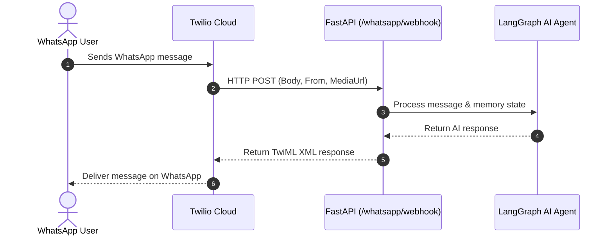

# WhatsApp Agent

## 📡 Twilio WhatsApp Webhook Flow

### How It Works
* **Webhook Concept**: An event-driven HTTP POST push notification. Instead of our server polling Twilio, Twilio automatically calls our endpoint when a user sends a message.
* **Flow**:
  1. **User** sends a message on WhatsApp -> Meta forwards to **Twilio**.
  2. **Twilio** sends an HTTP POST request to our FastAPI endpoint (`/whatsapp/webhook`).
  3. **FastAPI** parses `Body` & `From`, passes them to **LangGraph AI Agent**, and returns TwiML XML.
  4. **Twilio** delivers the AI reply back to the user on WhatsApp.



---

## 🚀 Quick Start

### 1. Run Server & Tunnel
```bash
uvicorn main:app --port 8000
ngrok http 8000
```

### 2. Setup Checklist
- [x] FastAPI running on port 8000
- [x] ngrok forwarding public URL to localhost:8000
- [x] Twilio Sandbox Webhook set to `https://<your-ngrok-url>/whatsapp/webhook`
- [x] Send WhatsApp message from phone to test

### 3. Test Webhook via Curl
```bash
curl -X POST http://127.0.0.1:8000/whatsapp/webhook \
  -H "Content-Type: application/x-www-form-urlencoded" \
  -d "Body=Hello from curl&From=whatsapp:+14155238886"
```

## 🧠 Mental Model

| Source | Sends `Body`? | Works? |
| --- | --- | --- |
| WhatsApp -> Twilio | ✅ Yes | ✅ YES |
| curl (form-data) | ✅ Yes | ✅ YES |
| FastAPI Swagger | ❌ No | ❌ NO |

## 🏗️ Architecture

```
WhatsApp (User)
   ↓
Twilio Webhook
   ↓
FastAPI (/whatsapp/webhook)
   ↓
LangGraph App (with SQLite memory)
   ├── Chat Agent (text + memory)
   ├── Vision Agent (image)
   └── Supervisor (routing)
```
