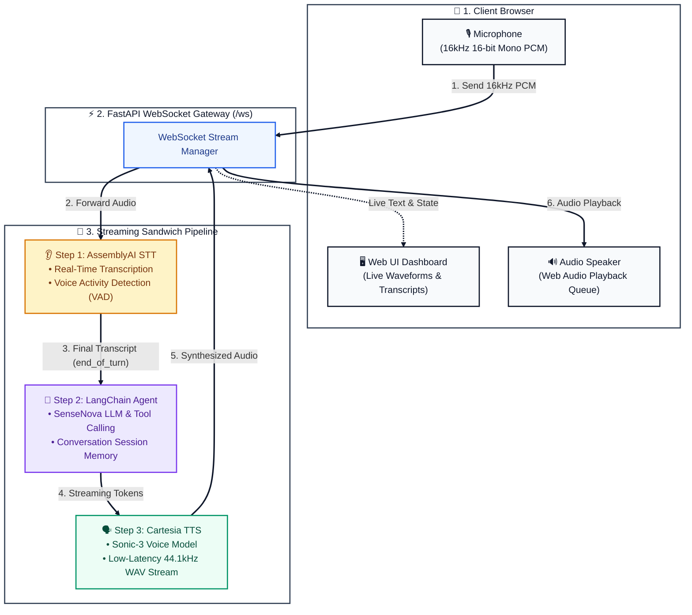
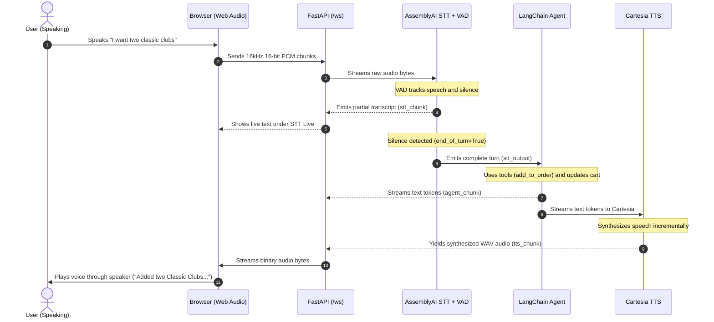

# 🥪 LangChain Voice Agent — Complete Architecture & Teaching Guide

Welcome to the **LangChain Voice Agent** project! This repository contains a production-grade, real-time conversational voice assistant built using **LangChain's `create_agent`**, **SenseNova LLM**, **AssemblyAI Real-Time STT with Voice Activity Detection (VAD)**, and **Cartesia Sonic-3 Streaming TTS**.

---

## 📑 Table of Contents
1. [Overview & Concept](#1-overview--concept)
2. [The "Sandwich" Architecture](#2-the-sandwich-architecture)
3. [System Architecture Diagram](#3-system-architecture-diagram)
4. [Step-by-Step Event Lifecycle](#4-step-by-step-event-lifecycle)
5. [Component Deep Dive (Student-Friendly Explanations)](#5-component-deep-dive)
6. [Interactive Visualizer Guide](#6-interactive-visualizer-guide)
7. [⚡ WebSockets Explained Guide (Plain English)](./WEBSOCKET_EXPLAINED.md)
8. [Directory & File Structure](#7-directory--file-structure)
9. [Installation & How to Run](#8-installation--how-to-run)
10. [Troubleshooting & FAQs](#9-troubleshooting--faqs)

---

## 1. Overview & Concept

A **Voice Agent** is an AI agent that you can talk to using spoken words instead of typing. It enables hands-free, natural conversations.

Every voice agent must solve three core tasks:
1. **👂 Listen**: Capture audio from the microphone and translate sound waves into words (Speech-to-Text).
2. **🧠 Think**: Understand user intent, look up information, execute tools, and plan responses (LangChain Agent + LLM).
3. **🗣️ Speak**: Convert the generated response text back into natural human speech audio (Text-to-Speech).

---

## 2. The "Sandwich" Architecture

We implement the **STT $\rightarrow$ Agent $\rightarrow$ TTS ("Sandwich") Pipeline**:

```
      🍞 Top Bread:     Speech-to-Text (AssemblyAI)  --> Converts Voice to Text
      🥩 The Filling:   LangChain Agent (SenseNova)  --> Understands & Decides
      🍞 Bottom Bread:  Text-to-Speech (Cartesia)    --> Converts Text to Voice
```

### Why Sandwich over Speech-to-Speech (S2S)?
- **Modularity**: You can swap the STT engine, LLM model, or TTS provider without rewriting the agent logic.
- **Advanced Agent Capabilities**: Full access to LangChain's reasoning, tool-calling, and state checkpointers.
- **Low Latency Streaming**: By chaining async streams (`RunnableGenerator`), speech synthesis begins as soon as the first sentence token is produced by the LLM.

---

## 3. System Architecture Diagram



---

## 4. Step-by-Step Event Lifecycle



---

## 5. Component Deep Dive

### 🎓 1. The Listener: Browser Microphone & WebAudio API
- **What it does**: Records your voice through the microphone, strips background room noise and echo, downsamples the audio from the computer's native rate (48,000 Hz or 44,100 Hz) down to **16,000 Hz 16-bit Mono PCM**, and sends it to the server.
- **Student Analogy**: *Like speaking into a walkie-talkie that converts your physical voice into an electronic signal.*

### 🎓 2. The Transcriber: AssemblyAI Real-Time STT & VAD
- **What it does**: Converts the streaming sound bytes into written words. Crucially, it includes **Voice Activity Detection (VAD)**. It sends partial words to the UI for instant feedback, but **only triggers the AI agent when you have finished speaking your full sentence** (`end_of_turn=True`).
- **Student Analogy**: *Like a court reporter who writes down every word you say, but waits until you finish your complete sentence before handing the note to the judge.*

### 🎓 3. The Brain: LangChain `create_agent` & SenseNova LLM
- **What it does**: Powered by the **SenseNova LLM** (`sensenova-6.8-flash-lite`), it interprets what you said, remembers what you ordered in earlier sentences (using `InMemorySaver`), and calls Python tools:
  - `get_sandwich_menu()`: Checks available sandwiches and drinks.
  - `add_to_order(item, quantity)`: Modifies the shopping cart.
  - `view_current_order()`: Calculates totals.
  - `confirm_and_place_order()`: Finalizes the order.
- **Voice System Prompt**: Formatted specifically for voice interaction: strictly concise (1-2 sentences), no emojis, and no markdown formatting.
- **Student Analogy**: *Like the friendly counter clerk at a sandwich shop who takes your order, remembers your requests, and uses the cash register to ring up the total.*

### 🎓 4. The Mouth: Cartesia Sonic-3 Streaming TTS
- **What it does**: Takes the words generated by the AI agent and converts them into natural, lifelike speech audio (WAV 44.1kHz).
- **Student Analogy**: *Like a voice actor reading a script out loud the exact second each sentence is written, without waiting for the whole book to finish.*

---

## 6. Interactive Visualizers Guide

We provide **two interactive, student-friendly visualizers** with clean white cards and live simulation controls:

### 1. 💻 Code Architecture & Streaming Engine Visualizer
- **Purpose**: Deep-dive function-by-function and class-by-class visual breakdown of all 8 files in the codebase.
- **How to Open**: **`http://localhost:8000/code-visualizer`** or open **[`code_architecture_visualizer.html`](./code_architecture_visualizer.html)**.
- **Features**: Searchable function explorer, input/output contracts, code snippets, and a 5-phase data pipeline animation.

### 2. 📊 System Architecture & Sandwich Flow Visualizer
- **Purpose**: High-level visual explanation of the 4 steps (Mic $\rightarrow$ STT $\rightarrow$ Agent $\rightarrow$ TTS) with real-world analogies.
- **How to Open**: **`http://localhost:8000/architecture`** or open **[`architecture_visualizer.html`](./architecture_visualizer.html)**.

---

## 7. Directory & File Structure

```text
voice agent/
├── README.md                          # Comprehensive Architecture & Teaching Guide
├── WEBSOCKET_EXPLAINED.md             # Plain English Guide to WebSockets in FastAPI & JS
├── code_architecture_visualizer.html  # Interactive Code Architecture & Function Visualizer
├── architecture_visualizer.html       # Interactive System Architecture Visualizer
├── events.py                          # Strongly-typed Event Dataclasses (STTChunk, AgentChunk, TTSChunk)
├── stt.py                             # AssemblyAI v3 Real-Time STT Client with VAD
├── agent.py                           # LangChain create_agent with SenseNova LLM, Tools & Memory
├── tts.py                             # Cartesia Sonic-3 Streaming TTS Client
├── pipeline.py                        # Composed RunnableGenerator Pipeline
├── server.py                          # FastAPI WebSocket & REST Application
├── test_end_to_end.py                 # Automated Verification & Integration Test Suite
└── static/
    ├── index.html                     # Voice Agent Web UI (The Daily Melt)
    ├── style.css                      # Modern UI Theme & Visualizer Styling
    ├── app.js                         # Browser WebAudio Capture (16kHz), Playback Queue & WebSocket
    ├── code_visualizer.html           # Hosted Code Architecture Visualizer
    └── architecture.html              # Hosted System Architecture Visualizer
```

---

## 8. Installation & How to Run

### Prerequisites
Make sure your root `.env` file contains the required API keys:
```env
SENSENOVA_API_KEY="your-sensenova-key"
ASSEMBLYAI_API_KEY="your-assemblyai-key"
CARTESIA_API_KEY="your-cartesia-key"
```

### 1. Install Dependencies
```bash
source .venv/bin/activate
uv pip install assemblyai cartesia websockets fastapi uvicorn requests langchain langchain-openai langgraph
```

### 2. Run the Verification Test Suite
```bash
python "voice agent/test_end_to_end.py"
```

### 3. Launch the Voice Agent Server
```bash
uvicorn "voice agent.server:app" --host 127.0.0.1 --port 8000 --reload
```

### 4. Interact
- Open your browser to **`http://localhost:8000`**.
- Click **"Start Microphone"** (or hold **"Hold to Talk"**).
- Speak naturally:
  > *"Hello! What sandwiches do you have on the menu?"*
  > *"Please add two classic clubs and an espresso to my order."*
  > *"What is in my cart right now?"*
  > *"Confirm my order for pickup under the name Sachin."*

---

## 9. Troubleshooting & FAQs

| Issue | Cause | Solution |
| :--- | :--- | :--- |
| **Microphone not transcribing** | Audio rate mismatch on macOS browsers. | `app.js` automatically resamples 48kHz down to 16kHz PCM. Hard refresh the page (`Cmd + Shift + R`). |
| **Agent answers too early** | VAD triggering on partial fragments. | Handled in `stt.py` by checking `if event.end_of_turn:`. |
| **No audio output** | Browser AudioContext suspended. | Click anywhere on the webpage or click "Start Microphone" to activate the browser audio context. |
