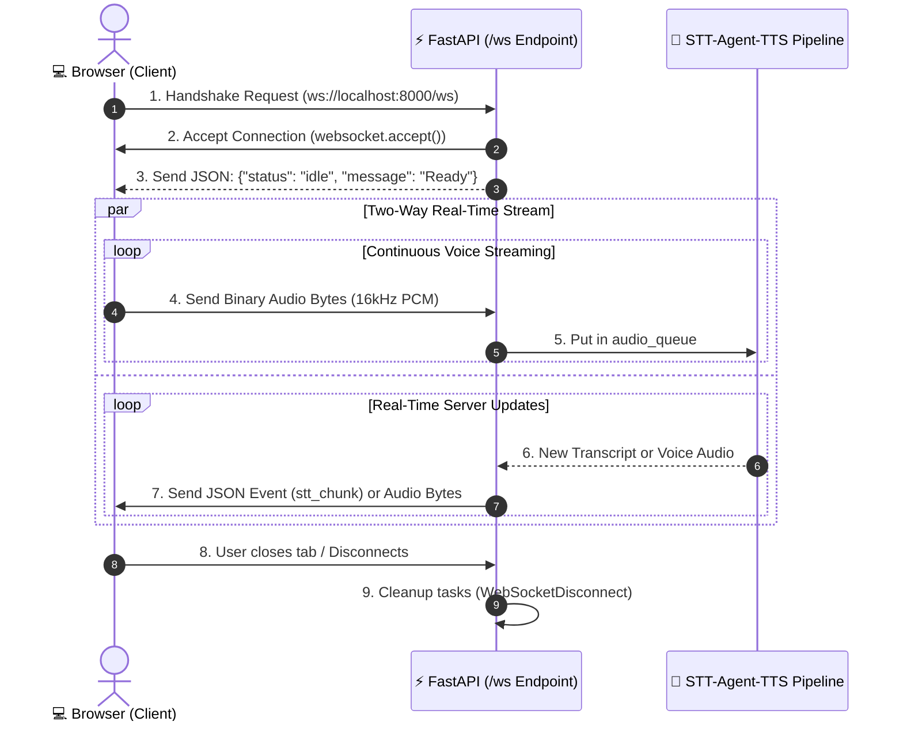

# ⚡ WebSockets in Plain English — How Real-Time Voice Streaming Works

This guide explains **what WebSockets are**, **why our Voice Agent needs them**, and **how every line of WebSocket code in our FastAPI backend and JavaScript frontend works**.

---

## 📑 Table of Contents
1. [What is a WebSocket? (The Simple Explanation)](#1-what-is-a-websocket)
2. [HTTP vs. WebSocket (The Real-World Analogy)](#2-http-vs-websocket)
3. [Why Voice Agents CANNOT Use Regular HTTP](#3-why-voice-agents-cannot-use-regular-http)
4. [How WebSockets Work in FastAPI](#4-how-websockets-work-in-fastapi)
5. [Code Breakdown: The FastAPI Backend (`server.py`)](#5-code-breakdown-the-fastapi-backend)
6. [Code Breakdown: The Browser Frontend (`app.js`)](#6-code-breakdown-the-browser-frontend)
7. [Student Summary & Cheat Sheet](#7-student-summary--cheat-sheet)

---

## 1. What is a WebSocket?

A **WebSocket** is a communication protocol that establishes a **continuous, two-way (bi-directional), real-time connection** between a web browser and a server over a single internet connection.

```
┌─────────────────┐       Continuous Open Two-Way Tunnel       ┌─────────────────┐
│                 │ ══════════════════════════════════════════> │                 │
│ Browser Client  │         Mic Audio & Messages Stream         │ FastAPI Server  │
│  (Microphone)   │ <══════════════════════════════════════════ │  (Voice Agent)  │
│                 │         Transcripts & Voice Audio           │                 │
└─────────────────┘                                             └─────────────────┘
```

Once opened:
- The browser can send data to the server **at any time**.
- The server can send data to the browser **at any time**.
- Neither side has to "reconnect" or "ask for permission" each time.

---

## 2. HTTP vs. WebSocket

To explain this to students or kids, use the **Postal Letter vs. Open Phone Call** analogy:

| Feature | Regular HTTP (Traditional Web) | WebSocket (Real-Time Web) |
| :--- | :--- | :--- |
| **Real-World Analogy** | ✉️ **Sending Letters in the Mail** | 📞 **An Active Phone Call** |
| **How it Works** | You send a letter $\rightarrow$ wait days for a reply $\rightarrow$ the exchange is over. If you want to say something else, you must write a brand new letter. | You dial once $\rightarrow$ pick up the phone $\rightarrow$ both people can talk and listen at the exact same second without hanging up. |
| **Direction** | **One-way at a time** (Client asks, Server replies). | **Two-way simultaneously** (Full Duplex). |
| **Connection State** | Connects, sends data, **closes immediately**. | Connects once, **stays open forever** until closed. |
| **Speed / Overhead** | Heavy (Headers sent every single request). | Ultra-lightweight (Raw bytes flow instantly). |

---

## 3. Why Voice Agents CANNOT Use Regular HTTP

When you speak into a microphone:
1. Your microphone captures **10 to 50 small audio chunks every single second**.
2. If we used regular HTTP (`POST /audio`), the browser would have to open a new connection, perform handshakes, send HTTP headers, and close the connection 50 times per second! This creates massive delays (lag) and uses too much bandwidth.
3. Furthermore, with HTTP, the server **cannot send audio back to your speaker** whenever it wants — it can only reply when asked.

**With WebSockets:**
- We open **one single tunnel** when the webpage loads (`ws://localhost:8000/ws`).
- Your microphone streams tiny audio chunks smoothly like water through a pipe.
- As soon as the agent starts speaking, the server streams audio bytes straight back down the same pipe without waiting!

---

## 4. How WebSockets Work in FastAPI



---

## 5. Code Breakdown: The FastAPI Backend (`server.py`)

Here is how FastAPI implements this step-by-step:

### Step 1: The WebSocket Endpoint
```python
@app.websocket("/ws")
async def websocket_voice_endpoint(websocket: WebSocket):
    # Step A: Accept the incoming connection ("Pick up the phone")
    await websocket.accept()
```
- `@app.websocket("/ws")`: Tells FastAPI this URL route is not a normal webpage, but an open WebSocket socket.
- `await websocket.accept()`: Accepts the connection handshake from the browser.

---

### Step 2: Safe Sending Helpers
```python
    # Helper: Send text/JSON to browser
    async def send_json(data: dict):
        if is_active:
            try:
                await websocket.send_text(json.dumps(data))
            except Exception:
                pass

    # Helper: Send binary audio bytes to browser
    async def send_bytes(data: bytes):
        if is_active:
            try:
                await websocket.send_bytes(data)
            except Exception:
                pass
```
- `websocket.send_text(...)`: Sends text/JSON messages (like live transcripts, order statuses, and token chunks).
- `websocket.send_bytes(...)`: Sends raw binary audio data (Cartesia voice audio) straight to the speaker queue.

---

### Step 3: Concurrency with `asyncio.Queue`
```python
    audio_queue: asyncio.Queue[bytes] = asyncio.Queue()

    # Generator reading audio from the queue
    async def client_audio_stream() -> AsyncIterator[bytes]:
        while is_active:
            chunk = await audio_queue.get()
            if chunk is None:
                break
            yield chunk
```
- While the user speaks, audio chunks arrive rapidly. We put them into an **asynchronous queue** (`audio_queue`).
- `client_audio_stream()` pulls chunks from the queue and feeds them continuously into **AssemblyAI STT**.

---

### Step 4: The Background Pipeline Runner
```python
    async def run_pipeline():
        # 1. STT Stream (Microphone -> AssemblyAI)
        stt = stt_stream(client_audio_stream(), sample_rate=16000)
        
        # 2. Agent Stream (AssemblyAI -> LangChain Agent)
        agent_events = agent_stream(stt, thread_id=thread_id)

        # 3. TTS Stream (LangChain -> Cartesia Audio)
        pipeline_output = tts_stream(agent_events)

        async for event in pipeline_output:
            if event.type == "tts_chunk":
                await send_bytes(event.audio)   # Send speech audio!
            else:
                await send_json(event.to_dict()) # Send live transcript!

    # Launch pipeline as a concurrent background task
    pipeline_task = asyncio.create_task(run_pipeline())
```
- `asyncio.create_task(run_pipeline())`: Starts the entire STT $\rightarrow$ Agent $\rightarrow$ TTS sandwich in the background so it runs independently.

---

### Step 5: The Message Listening Loop
```python
    try:
        while True:
            # Wait for any incoming message from the browser
            message = await websocket.receive()

            if "bytes" in message and message["bytes"]:
                # Browser sent microphone audio bytes
                await audio_queue.put(message["bytes"])

            elif "text" in message and message["text"]:
                # Browser sent a JSON command (e.g. typed text)
                payload = json.loads(message["text"])
                ...
    except WebSocketDisconnect:
        # Browser closed the tab or stopped connection
        is_active = False
        pipeline_task.cancel()
```
- `await websocket.receive()`: Pauses until the browser sends something.
- If **binary bytes** arrive: It's microphone speech! We put it in the queue for AssemblyAI.
- If **text** arrives: It's a text prompt or stop command.
- `except WebSocketDisconnect`: Cleans up memory and cancels background tasks when the user leaves.

---

## 6. Code Breakdown: The Browser Frontend (`app.js`)

Here is how the JavaScript side in the user's browser interacts with the WebSocket:

### Step 1: Connecting
```javascript
// Build WebSocket URL: ws://localhost:8000/ws
const protocol = window.location.protocol === 'https:' ? 'wss:' : 'ws:';
const wsUrl = `${protocol}//${window.location.host}/ws`;

ws = new WebSocket(wsUrl);

// Tell browser we receive raw binary audio data
ws.binaryType = 'arraybuffer';
```
- `ws.binaryType = 'arraybuffer'`: Crucial! This tells the browser that incoming binary data is raw audio bytes rather than a blob.

---

### Step 2: Receiving Messages from Server
```javascript
ws.onmessage = async (event) => {
    if (typeof event.data === 'string') {
        // 1. Received JSON metadata (transcripts, state)
        const data = JSON.parse(event.data);
        handleServerEvent(data);
    } else if (event.data instanceof ArrayBuffer) {
        // 2. Received binary speech audio (WAV bytes) from Cartesia!
        queueAudioForPlayback(event.data);
    }
};
```
- If the server sends text: We parse the JSON and update the live transcript on screen.
- If the server sends binary bytes: We immediately queue the audio chunk to play through the speakers!

---

### Step 3: Sending Microphone Audio Chunks (What is PCM?)
```javascript
audioProcessor.onaudioprocess = (e) => {
    if (!isRecording) return;

    const inputData = e.inputBuffer.getChannelData(0);
    
    // 1. Resample 48kHz -> 16kHz
    const pcmFloat = downsampleBuffer(inputData, audioContext.sampleRate, 16000);

    // 2. Convert Float32 [-1.0, 1.0] to 16-bit PCM Int16 [-32768, +32767]
    const pcm16 = new Int16Array(pcmFloat.length);
    for (let i = 0; i < pcmFloat.length; i++) {
        const s = Math.max(-1, Math.min(1, pcmFloat[i]));
        pcm16[i] = s < 0 ? s * 0x8000 : s * 0x7FFF;
    }

    // 3. Send binary PCM chunk down the WebSocket pipe!
    if (ws && ws.readyState === WebSocket.OPEN) {
        ws.send(pcm16.buffer);
    }
};
```
- **What is PCM (Pulse-Code Modulation)?**: Raw, uncompressed sound measurements stored as integer numbers. Unlike MP3/AAC, PCM has **zero decompression delay**, allowing speech AI to recognize words instantly.
- **Why 16kHz Int16?**: Browser mics record 48,000 measurements/sec (studio quality). Speech AI models (AssemblyAI) only need 16,000 measurements/sec. Resampling down to 16kHz cuts **66% of network bandwidth**.

---

## 7. Student Summary & Cheat Sheet

| Question | Answer in 1 Sentence |
| :--- | :--- |
| **What is a WebSocket?** | An open, two-way digital telephone line between browser and server that stays connected continuously. |
| **Why not regular HTTP?** | HTTP hangs up after every single message; WebSockets stay open so audio can stream instantly with zero delay. |
| **How does FastAPI accept it?** | Using the `@app.websocket("/ws")` route decorator and calling `await websocket.accept()`. |
| **What data travels over it?** | Microphone PCM audio bytes going **UP** to the server; live transcripts and synthesized voice audio flowing **DOWN** to the browser. |
| **What happens on disconnect?** | FastAPI catches `WebSocketDisconnect`, stops the background AI tasks, and frees up memory. |
